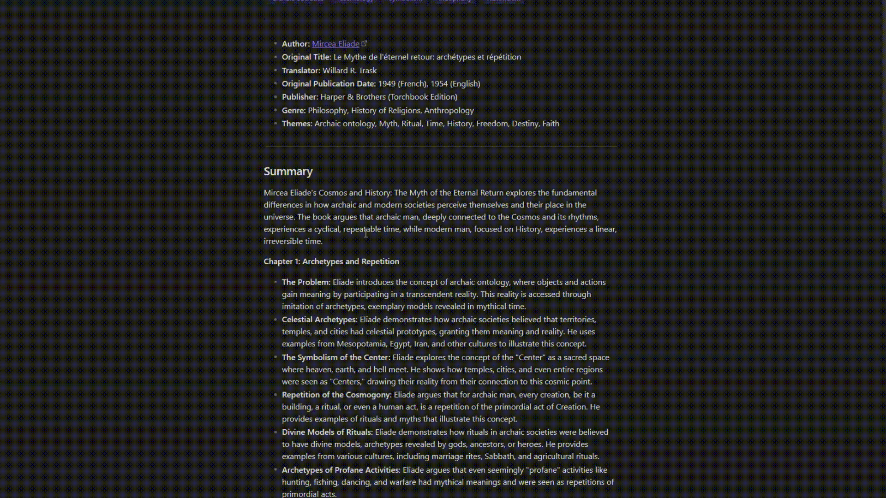

# Obsidian Wikipedia Preview Popup

## About

**Wikipedia Preview Popup** is a plugin for Obsidian that enhances your reading experience by providing previews for Wikipedia links directly within the note. This plugin is designed to make research and note-taking more efficient by allowing users to quickly access summaries and overviews of linked Wikipedia articles without leaving the note.

## Features

- **Automatic Previews:** Automatically generates previews for links matching the pattern `[https://en.wikipedia.org/wiki/][Article Title]`. When you hover over such links, a popup will display the article's summary and featured image (if available).

- **Customizable Styling:** Users can customize the appearance of the previews through CSS, allowing for a personalized look that fits their workflow.

- **Responsive Design:** The preview adapts to various screen sizes, ensuring a consistent user experience across devices, whether on desktop or mobile.

- **Image Support:** Displays the featured image from the Wikipedia article, enhancing the visual context of the preview.

- **Easy Installation:** Quick setup process to integrate seamlessly into your existing Obsidian environment.

## Installation

To install the Wikipedia Preview Popup plugin, follow these steps:

1. **Download the latest release** from the [GitHub Releases](https://github.com/szvest/obsidian-wikipedia-preview/releases) page.

2. **Extract the downloaded archive** into your Obsidian vault. Ensure that the folder structure is maintained.

3. **Enable the plugin** in Obsidian's settings:
   - Go to **Settings** > **Community plugins**.
   - Toggle the **Safe mode** off.
   - Click on **Browse** and search for "Wikipedia Preview Popup".
   - Click **Install** and then **Enable** the plugin.

## Usage

Once installed, the plugin automatically activates when you hover over a compatible Wikipedia link. Simply move your cursor over the link to see the Wikipedia-style preview. The popup will display:

- A brief summary of the article.
- A thumbnail image (if available).
- A link to read the full article on Wikipedia.

## Contributing

Contributions to improve the Wikipedia Preview Popup plugin are welcome! If you have suggestions, bug reports, or would like to contribute code, please feel free to submit pull requests or report issues on the [GitHub repository](https://github.com/szvest/obsidian-wikipedia-preview/issues).

### Contribution Guidelines

- Ensure your code follows the existing style and conventions.
- Write clear commit messages.
- Include tests for new features or bug fixes.

## License

Wikipedia Preview Popup is released under the MIT license. See the `LICENSE` file for more details.

## Acknowledgments

- Thanks to the Obsidian community for their support and contributions.
- Special thanks to the Wikipedia API team for providing access to their extensive knowledge base.

## Contact

For any inquiries or support, please reach out via the [GitHub repository](https://github.com/szvest/obsidian-wikipedia-preview) or create an issue for assistance.
